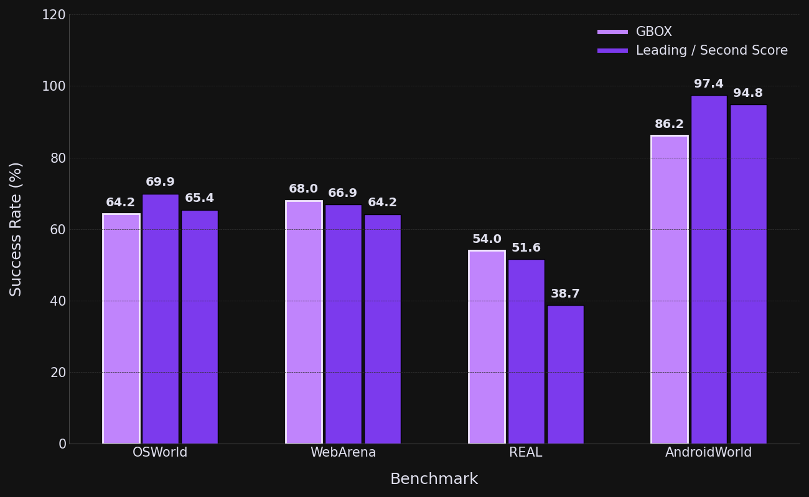
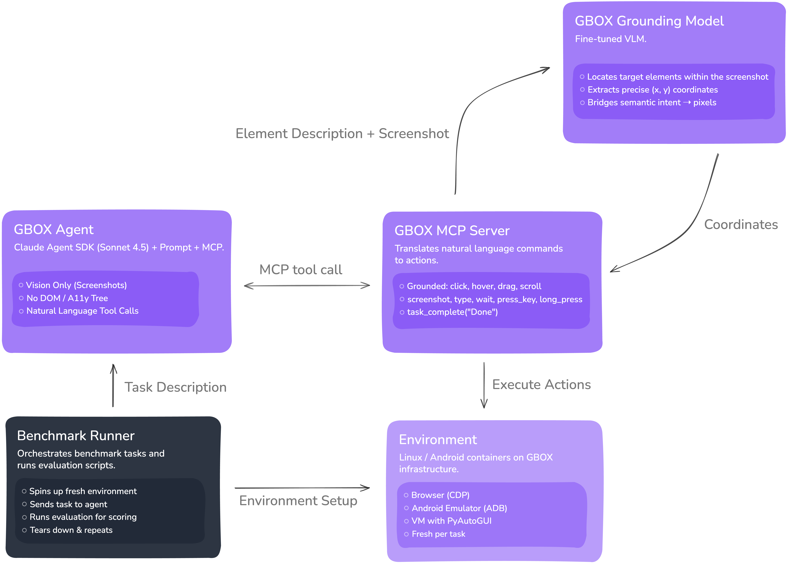

# From Vision to Action — Towards General-Purpose GUI Agents

## The Gap Between Automation and True Agency

GBOX is pioneering a new paradigm in AI-driven automation with the launch of its state-of-the-art Computer Use Agent (CUA), which has achieved top performance on four major benchmarks. CUAs are designed to automate digital tasks by operating a computer in the same way a human does, navigating GUIs to execute complex workflows. This technology marks a significant leap forward from existing solutions, promising to handle tasks ranging from mundane refunds and charge disputes to sophisticated white-collar operations in finance, accounting, and payroll processing.

True autonomy is out of reach for current general-purpose agents, which are tethered to rigid API calls and carefully scripted prompts. This severely limits their ability to interact with software, a critical weakness given that many legacy systems lack API access. Furthermore, this approach demands a prescribed workflow that effectively overfits the agent to the task, causing the entire process to fail at the slightest deviation—a signature flaw they share with traditional RPA. CUAs provide a robust alternative, operating directly on a machine's native interface much like an agentic coworker.

The primary limitation of today’s CUA landscape stems from how agents perceive applications. Instead of seeing the screen visually, they rely on programmatic backdoors such as the DOM or Accessibility (A11y) trees, which expose a code-level representation of the interface. This approach is fundamentally flawed. Recent research shows that visual input serves as a far more efficient compression medium, capable of encoding dense textual and structural information with drastically fewer tokens than equivalent digital text ([DeepSeek-AI](https://arxiv.org/pdf/2510.18234), 2025; Wei et al., 2025). By ignoring this advantage, text-based agents incur massive information overhead.

This inefficiency emerges in two critical ways. First, the method does not scale. Modern applications contain enormous DOM and A11y graphs, flooding agents with thousands of irrelevant element IDs and quickly exhausting their context windows. Second, the representation lacks semantic grounding. Cryptic identifiers like click(bid='237') provide no contextual meaning, forcing the agent to navigate an abstract code map rather than an intuitive visual layout. As a result, automations become brittle, difficult to debug, and prone to breaking with even minor HTML changes, even when the visual interface stays the same.

## The GBOX Approach: A Pure-Vision CUA

The GBOX agent demonstrates SOTA performance by adopting a pure-vision approach. GBOX achieved the leading score on [WebArena](https://docs.google.com/spreadsheets/d/1M801lEpBbKSNwP-vDBkC_pF7LdyGU1f_ufZb_NWNBZQ/edit?gid=0#gid=0) (68.0%) and [REAL](https://realevals.ai/) (54.0%), while also securing a third place on [OSWorld](https://os-world.github.io/) (64.2%). GBOX's success is rooted in its highly accurate action execution, equipping the AI models with superior control.

GBOX uses the Claude Agent SDK to manage complete task processes, including navigating websites, entering text, clicking elements, scrolling, and analyzing visual feedback to accomplish complex automation tasks. As shown in the architecture below, the Benchmark Runner supplies the agent with a task and an environment, which the agent then acts upon using the vision-powered GBOX MCP server.

Agents are able to use [GBOX MCP](https://github.com/babelcloud/gbox-mcp-server/tree/main) to describe its target using vision-based recognition. The MCP exposes a comprehensive suite of control primitives for precise interaction:

- [**mcp__gbox__screenshot**](https://docs.gbox.ai/api-reference/ui-action/take-screenshot) — Capture the current screen state
- [**mcp__gbox__click**](https://docs.gbox.ai/api-reference/ui-action/click) — Click on UI elements by visual description
- [**mcp__gbox__type**](https://docs.gbox.ai/api-reference/ui-action/type-text) — Enter text into input fields
- [**mcp__gbox__long_press**](https://docs.gbox.ai/api-reference/ui-action/long-press) — Perform long press interactions
- [**mcp__gbox__drag**](https://docs.gbox.ai/api-reference/ui-action/drag) — Drag elements across the screen
- [**mcp__gbox__scroll**](https://docs.gbox.ai/api-reference/ui-action/scroll) — Scroll through content
- [**mcp__gbox__press_key**](https://docs.gbox.ai/api-reference/ui-action/press-key) — Simulate keyboard input
- **mcp__gbox__hover** — Hover over elements
- **mcp__gbox__wait** — Pause execution for specified duration

*Example: The agent visually identifies and clicks the "Authenticate" button at the bottom right of the authentication dialog*

At its core, the GBOX MCP leverages a fine-tuned Vision Language Model (VLM) to detect elements on the screen, mirroring human visual identification. This vision-first methodology ensures that the agent can operate across different browsers and screen resolutions without modification and is not dependent on parsing mappings of countless element IDs.

The synergy between GBOX's vision-based control and Claude's reasoning allows the AI agent to perform robust, adaptable, and easily understandable multi-step automation, making the completion of long-horizon tasks feasible.

## Overcoming Current Limitations

Despite these advancements, there are recognized limitations. The pixel-based approach, while robust, can be slower than methods that utilize the accessibility tree or direct code execution, with GBOX's actions currently completing in 980 milliseconds.

More significant limitations lie within the agent's "brain." Tasks take a substantial amount of time to complete because the reasoning capability acts as a bottleneck. Current models typically require 3 to 5 seconds just to process a single step. Beyond this latency, complex tasks require sophisticated cognitive steps, and while current models are good at planning and grounding, they often lack an understanding of social norms. Humans performing long-form tasks draw upon a wealth of ingrained experience and implicit social rules that are seldom documented online. This lack of data on procedural nuances presents a challenge for training. Furthermore, they struggle to maintain context throughout a long workflow, often forgetting critical details from earlier steps.

Moreover, the agents struggle with "negative tasks," which are situations where a goal is impossible to achieve. An agent may exhaust its capabilities and begin to hallucinate steps rather than concluding that the task is not feasible. This highlights a critical challenge in agent development: teaching them how to handle ambiguity and failure.

The proposed solution to these cognitive hurdles is the implementation of a [Reinforcement Learning (RL)](https://gbox.ai/home/rl-environment) environment. By providing a sandboxed environment with a variety of applications, models can learn and adapt in a way that replicates human trial-and-error learning. This approach allows agents to build the experiential knowledge necessary for more complex, real-world tasks.

## Future Directions

The architecture of CUAs is continuously evolving. Unified models that combine the "brain" and "hand" into a single seamless system represent a major area for improvement, promising to eventually close the gap between reasoning and execution. Future iterations may go even further by featuring agents capable of receiving a continuous stream of observations rather than just static "before and after" screenshots of an action. Currently, agents function like they are viewing a slideshow, missing everything that happens between frames. A shift to real-time video processing would allow agents to perceive the interface dynamically by tracking loading animations and reacting to fleeting notifications instantly. As these capabilities mature, we're moving toward a future where AI agents can truly operate as digital coworkers across any interface.